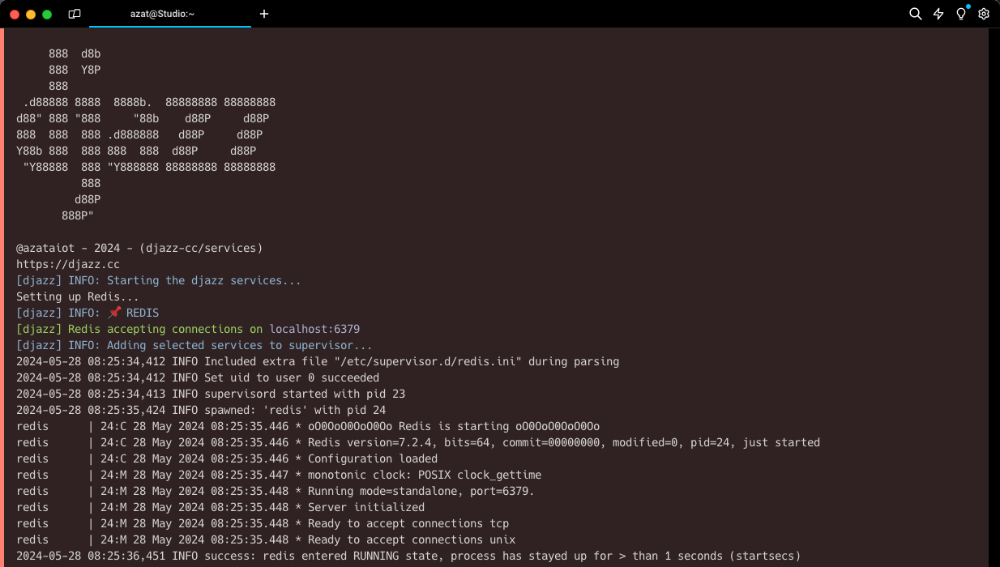

# Djazz Services


Djazz Services is an all-in-one development framework for building web applications and APIs with Django.

To learn more about Djazz and how to use it, visit the [GitHub repository](https://github.com/azataiot/djazz).

## Why Djazz Services?

Unlike typical tutorials, Djazz is designed with production-readiness in mind. It leverages essential backend services such as PostgreSQL instead of SQLite, among others. While a simple Django project might suffice for learning purposes, real-world applications require a more robust setup involving components like Redis, Celery, RabbitMQ, and caching from the start.

Setting up such an environment can be time-consuming. Djazz Services aims to streamline this process by providing a comprehensive development environment with PostgreSQL and its essential extensions, Redis, RabbitMQ, and even tools for local email testing, all configured and ready to use.

With Djazz Services, you can focus on writing your Djazz code without worrying about the complexities of setting up and configuring the development environment.

## Included Services
- [x] Mailpit - Local email testing tool (SMTP).
- [x] MinIO - S3-compatible object storage server.
- [x] PostgreSQL - Our beloved relational database.
- [x] RabbitMQ - Message broker for Celery.
- [x] Redis - In-memory cache for Django.
- [ ] pgAdmin - PostgreSQL administration tool\*.
- [ ] Any other services you might need in the future 🥰.

\* pgAdmin is not included in the current version but will be added in the future if there is a demand for it.

## How to use

Using Djazz Services is easy, we assume you have already installed [Docker](https://docs.docker.com/) on your development computer or VM, and then you can start running Djazz Services by executing the following commands in your terminal: 

```bash
docker run -it --rm \
    -p 1025:1025 \
    -p 5432:5432 \
    -p 5672:5672 \
    -p 6379:6379 \
    -p 8025:8025 \
    -p 9000:9000 \
    -p 9001:9001 \
    -p 15672:15672 \
azataiot/djazz-services:latest
```
Or you can run only the services you need by specifying the service name(s) as an argument to the container:

```bash
docker run -it --rm \
    -p 1025:1025 \
    -p 5432:5432 \
    -p 8025:8025 \
azataiot/djazz-services:latest mailpit postgresql
```
Security Note: The above command exposes the services to the host machine, which is not recommended for production environments. For production, you should use a reverse proxy like trafficker to expose the services securely, also you should only expose the services you need.

## Configurations

Djazz Services comes with default configurations that should work out of the box for most users. However, you can customize the services by providing your own configuration files or by providing environment variables. To do this, you need to mount your configuration files to the appropriate directories inside the container.

Here are some examples of how to customize the services:

```bash
docker run -it --rm \
    -e POSTGRES_USER=djazz \
    -e POSTGRES_PASSWORD=djazz \
    -e POSTGRES_DB=djazz \
    -p 5432:5432 \
    azataiot/djazz-services:latest postgres
```